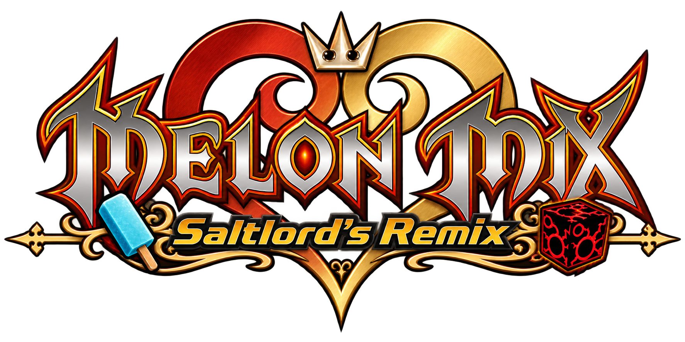

  

  An Android fork of a fork of Melon Mix, built for a modern way to play
  <i>Kingdom Hearts 358/2 Days</i> and <i>Kingdom Hearts Re:Coded</i>.

---

## 👑 About Saltlord's Remix

**Saltlord's Remix began two days after the initial melonMix Android port was released.**

When I discovered [Nireves333's](https://github.com/Nireves333) Android port of melonMix, I was immediately excited. Having melonMix running natively on Android was already an amazing foundation for playing the Kingdom Hearts DS games on modern devices.

But actually playing 358/2 Days on a touchscreen also made me realise there were a few things missing if I wanted it to feel truly natural as an Android game rather than a DS game being played through touchscreen controls.

And this project started because I wanted to fix exactly **one** of them.

358/2 Days is my favourite game in the Kingdom Hearts series, and using shortcuts on a touchscreen meant awkwardly holding a virtual shoulder button while trying to press another virtual control at the same time.

So, just two days after the original Android port appeared, I started tinkering with my own fork. All I wanted was a touchscreen shortcut button that could toggle and hold the required input for me.

That worked.

Then I wanted a proper camera joystick.

Then I wanted **two independent relative joysticks** that could be placed anywhere on the screen.

Then I wanted the controls to actually look and behave like Kingdom Hearts controls instead of a generic DS overlay.

Then came custom layouts, context-sensitive controls, display profiles, foldable support, game-specific behaviour, cinematic handling...

And, well...

**The rest is history.** 💀

What began as a tiny personal modification to an already fantastic Android port has gradually become **Saltlord's Remix**: a touch-first fork built on Nireves333's melonMix Android port and designed specifically around **Kingdom Hearts 358/2 Days** and **Kingdom Hearts Re:Coded**.

The aim isn't to replace melonMix or its Android port. It's to take that incredible foundation and build a more specialised experience on top of it — one designed around how these two games actually play on modern Android hardware.

That means thinking about their controls, camera, command menus, shortcuts, cinematics and screen layouts not as generic Nintendo DS inputs that happen to be on a touchscreen, but as parts of an Android experience that should feel comfortable and intentional.

The goal is simple:

**Make the Kingdom Hearts DS games feel like they actually belong on the Android device you're playing them on.**

---

## ✨ What Saltlord's Remix brings to the table

The Remix currently includes:

- **Fully customisable touchscreen layouts**, with controls that can be positioned and resized around your device.
- **Independent relative movement and camera joysticks**, allowing analogue-style touchscreen control without being tied to fixed joystick positions. You can set a custom region of the screen to act as camera and movement joysticks.
- **Kingdom Hearts-style command controls** designed around the games rather than a generic DS button overlay.
- **Touch-friendly shortcut controls**, including the feature that accidentally started this entire project: a shortcut toggle that can hold the required input for you.
- **Dedicated touchscreen lock-on controls**.
- **Context-sensitive controls** that appear only when they're relevant and stay out of the way during dialogue and cinematics.
- **Automatic control hiding** designed to keep the screen clean when controls aren't needed. A custom timer can be set to auto-hide the controls or be deactivated entirely.
- **Physical controller support**, including behaviour designed to keep unnecessary touchscreen controls out of the way when using a gamepad.
- **Per-control customisation**, including positioning, sizing and opacity.
- **Snap-to-grid layout editing** for cleaner and more consistent custom layouts.
- **Multiple display profiles and aspect-ratio handling** designed around modern Android screens.
- **Separate portrait and landscape pre-configured touchscreen layouts**.
- **Foldable-aware layouts** designed around cover screens, unfolded displays and changing device orientations.
- **HD replacement cinematics, subtitles and melonMix's existing enhancement features** integrated into the Remix experience.
- New **Game-specific configuration** options for 358/2 Days and Re:Coded.
- **Custom Saltlord's Remix interface, artwork and visual identity** inspired by the two games.
- **Layout and configuration persistence across updates**, because spending an hour perfecting a touchscreen layout only to have an update nuke it would be deeply offensive.

And yes, **Re:Coded works too.**

What started as me obsessively modifying 358/2 Days has officially become a two-game project.

---

## 🔧 What's still being worked on

Saltlord's Remix is approaching the point where I'm comfortable calling it ready for a proper public release, but there are still systems being polished, fixed and tested.

Current work includes:

- Finishing the **first-run Setup Wizard** so a fresh installation can be configured without digging through settings. The app will feel incredibly user-friendly upon release, meaning even those with limited emulation knowledge should be able to jump right in.
- Finalising the **Saltlord's Remix interface, branding and light/dark themes**.
- Improving **HD cinematic orientation handling** across conventional phones and foldables.
- Adding **per-game HD cinematic orientation controls** for Automatic, Landscape and Portrait playback.
- Fixing and verifying **touch-layout backup and restore**.
- Improving the **Layout Editor**, including clearer Snap-to-Grid behaviour and a visible alignment grid.
- Finalising the newest **default touchscreen layouts** for different display and orientation configurations.
- Expanding the **Kingdom Hearts-style frontend menu sounds** while keeping them subtle enough that they don't drive everyone insane.
- Tightening the game library around the **two games Saltlord's Remix is actually designed for**. No Pokémon or ambiguous other will run in this hen house.
- Continuing to improve behaviour across different Android display sizes and form factors.
- General bug fixing, regression testing and polishing the app until somebody can install it without needing me standing behind them explaining what seventeen different settings do.

The intention isn't to keep piling features onto the project forever.

The finish line is an app that somebody can install, point towards their own legally obtained game dumps and required assets, configure without fuss, and start playing.

---

## 📱 A very important device-testing disclaimer

**Saltlord's Remix has been designed, developed and overwhelmingly tested on a Samsung Galaxy Z Fold8 Ultra.**

That device is effectively Remix HQ.

As a result, book-style foldable behaviour — particularly Fold cover-screen and unfolded-screen configurations — has received by far the most hands-on testing during development.

I've tried to make the display, layout and control systems adaptable rather than hard-coding everything around one phone, but I unfortunately do not own every Android device ever created.

This means bug reports from other form factors are **especially welcome**.

If you're using:

- A conventional candybar phone
- A flip-style foldable
- Another book-style foldable
- A tablet
- An unusually shaped Android device
- Or some wonderfully cursed piece of hardware I never anticipated

...please let me know if something doesn't behave properly.

Screenshots, device information, reproduction steps and logs are incredibly useful.

The goal is for Remix to work well beyond the device it was born on, and feedback from people actually using those devices is the best way to get there.

---

## 🤖 A note about AI, "vibe coding" and development

I'll get this one out of the way:

**I'm not an app developer.**

I'm a Kingdom Hearts fan who wanted a shortcut button, had a very specific idea of how these games should feel on a modern touchscreen, and then made a series of increasingly questionable decisions until that somehow became an entire Android fork. 💀

AI has been used heavily throughout the development of Saltlord's Remix.

It has helped me understand and navigate an unfamiliar codebase, write and modify code, trace existing systems, debug problems and turn ideas I would not otherwise have had the technical ability to implement into working features.

I'm not interested in pretending the project was made differently than it was.

I also know there's plenty of discourse around AI-assisted or "vibe coded" software, particularly when it comes to Android ports.

That's okay.

**The simple reality is that Saltlord's Remix would not exist without AI.**

This project was originally designed for me. It began as something I wanted to use personally, and AI gave me the ability to start building the version of these games that had been living in my head despite not having a conventional software-development background.

That doesn't mean every implementation will be perfect the first time, and it certainly doesn't mean bugs won't exist.

They will.

Software written entirely by experienced human developers has bugs too. What matters to me is that when issues are discovered, they can be identified, reproduced, understood and addressed.

And that's also why this project is open source.

If you're an experienced developer and look at something I've implemented and think:

> "There is a much better way to do this."

**Please contribute it.**

Seriously.

Code improvements, fixes, optimisation, cleanup, suggestions and pull requests are welcome. I'd much rather somebody contribute a better solution than pretend a personal project created with heavy AI assistance has nothing left to learn.

The same goes for users.

Good bug reports are contributions too.

If something breaks, tell me what happened. If you can reproduce it, tell me how. If it only explodes on your specific phone when it's upside down during a full moon, I would still genuinely like to know.

Saltlord's Remix started as a port made for me.

If it can become a great way for other people to experience these games too, that's a very happy accident. ❤️

---

## ❤️ Credits & thanks

**Saltlord's Remix would not exist without melonMix or the people whose work brought it to Android.**

A massive thank you to [Nireves333](https://github.com/Nireves333), the developer behind the original **melonMix Android port** that this fork is built upon.

Their work provided the Android foundation that made this entire project possible. Without it, there would have been no shortcut button to modify, no touchscreen experience for me to obsess over, and almost certainly no Saltlord's Remix.

Just as importantly, enormous credit belongs to the **original melonMix developers and contributors** whose work made this enhanced way of experiencing the Kingdom Hearts DS games possible in the first place.

Saltlord's Remix is built **on top of that work, not in place of it**.

My contribution is focused primarily on reshaping and extending the Android experience around touchscreen play, modern display ratios, foldables, game-specific controls and the particular needs of 358/2 Days and Re:Coded.

Additional community work, artwork and assets used by Saltlord's Remix will also be credited individually where applicable.

Thank you to everyone whose work sits underneath this increasingly elaborate project.

It is genuinely wild to me how far this has come.

All because I wanted **one goddamn shortcut button.** ❤️

---

## 🐛 Bugs, feedback & contributions

If you're testing Saltlord's Remix and find a problem, please report it.

When possible, include:

- Your device and Android version
- Which game you're playing
- Your screen/orientation configuration
- What you expected to happen
- What actually happened
- Steps that reliably reproduce the issue
- Screenshots or screen recordings where useful
- Logs where available

Reports from devices other than the Galaxy Z Fold8 Ultra are particularly useful while the project expands beyond its primary development hardware.

Code contributions and pull requests are also welcome.

If you know more than I do and can make something better, **please do**. That's one of the reasons the source is here.

---

*Saltlord's Remix is an unofficial fan project and is not affiliated with or endorsed by Square Enix, Disney, Nintendo or the respective rights holders. No commercial game ROMs are distributed with this project. Users are responsible for providing their own legally obtained game dumps and any required assets.*

---

# Original melonMix Android Port

The following is the original README from Nireves333's melonMix Android port, which this fork is built upon.

---

# KH Melon Mix on Android. 

I couldn't find an Android port of KH Melon Mix so I attempted to make one that runs on my Anbernic RG505. One
widescreen screen, camera on the right stick, HD cutscenes, remastered music. It's
[melonDS-android](https://github.com/rafaelvcaetano/melonDS-android) with the [KH Melon Mix](https://github.com/vitor251093/KHMelonMix) features ported into it.

| Game select | 358/2 Days | Re:coded |
|---|---|---|
|  |  |  |

I built and tested this on an RG505 and nothing else. You're welcome to run it on
other devices and to build on the code, but I can't promise anything beyond my own
setup. If something breaks, open a bug report in [Discussions](https://github.com/Nireves333/melonMix-android/discussions) here, not on KH Melon Mix or melonDS. I'll try to fix issues when I can :)

There's a ready-made APK on the
[releases page](https://github.com/Nireves333/melonMix-android/releases). Setup,
building from source, asset packs and known issues are all in
**[the guide](./GUIDE.md)**.

## Features

- The whole game on one widescreen screen. The HUD, minimap and command menu are
  moved onto it.
- Upscaled internal resolution. 3x holds (mostly) 60fps on the RG505 in normal non-overclocked mode.
- Camera on the right stick. Lock On and Switch Target get their own buttons, and
  the command menu goes on the d-pad.
- A "KH layout" button in the settings that applies all the recommended bindings
  at once.
- HD cutscene replacement with subtitles in six languages (Days only).
- Remastered music replacement with proper loop points (both games).
- The app itself is reworked for the two games: KH styled game select screen, menu
  sounds, and settings cut down to what these games actually need/use.

Not in it: texture replacement, HD cutscenes for Re:coded (upstream doesn't have
those yet either), Lua scripting.

Possible update: Touch controls, when I have time :)

## ROMs

This repo has no ROMs, no BIOS files and no game assets, and I won't link to any.
Dump your own games, and use the **US versions**: that's what the Melon Mix
enhancements are made for. EU and JP ROMs work with limited support and can
glitch (see the guide). Please don't ask.

## Credits

This project is a port of other people's work:

- [KH Melon Mix](https://github.com/vitor251093/KHMelonMix). All the enhancements
  come from them: vitor251093, justedni, Kite2810, sandwichwater, DaniKH1 and their
  community. If you're on PC, use their version.
- [melonDS-android](https://github.com/rafaelvcaetano/melonDS-android) by
  rafaelvcaetano, the app this is built on.
- [melonDS](https://github.com/melonDS-emu/melonDS), the emulator under everything.

## License

GPLv3, same as melonDS, melonDS-android and KH Melon Mix. See [LICENSE](./LICENSE).
The modified emulator core is public in the
[melonMix-android-lib](https://github.com/Nireves333/melonMix-android-lib) submodule.

This repository is co-authored by Anthropic's Claude.
